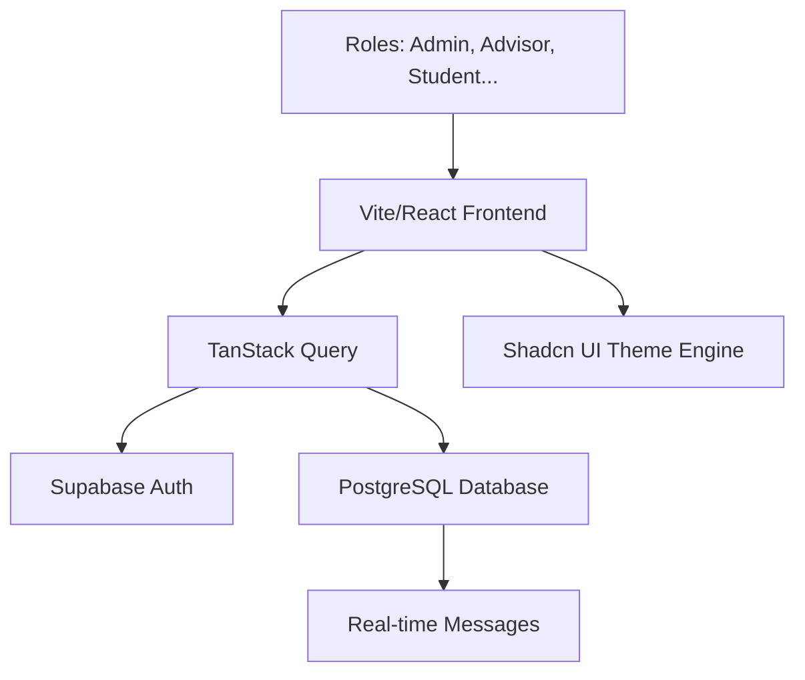

InternHub is a premium, full-stack internship management platform designed to bridge the gap between universities, students, and the professional world. Built with a focus on data integrity, specialized roles, and a seamless user experience.

### 🌐 [Live Demo](https://internship-platform-l2ghr47kv-hussen-ahmeds-projects.vercel.app)

---

## ✨ Core Feature Highlights

### 🛡️ Data Integrity & Verification
- **Student Verification Pipeline**: Unique to InternHub, Advisors can audit student profile data (Student ID, Major) before granting application permissions.
- **Smart Onboarding**: Dynamic role-based profile completion that ensures the right data is collected from the right users.

### 🌓 Premium User Experience
- **Instant Dark Mode**: A system-integrated theme engine with persistence and smooth transitions.
- **Modern UI Kit**: Built with Shadcn UI and Tailwind CSS for a professional, glassmorphic aesthetic.
- **Real-time Engine**: Powered by Supabase for instant messaging and application status updates.

### 👥 Specialized User Roles
| Role | Responsibility | Key Features |
| :--- | :--- | :--- |
| **Admin** | Platform Oversight | User Sync, Role Management, System Audits |
| **Coordinator** | Program Strategy | Department Analytics, High-level Placement Tracking |
| **Advisor** | Data Guardianship | Student Verification, Advisee Management, Approvals |
| **Employer** | Talent Acquisition | Internship Posting, Candidate Review, Interview Scheduling |
| **Student** | Career Growth | Profile Building, Internship Discovery, Application Tracking |

---

## 🏗️ Architecture Overview



---

## 🚀 Getting Started

### 1. Prerequisite
- Node.js 18+
- Supabase Account

### 2. Initial Setup
```bash
# Install dependencies
npm install

# Setup Environment
# Create .env and add your variables:
# VITE_SUPABASE_URL=your_project_url
# VITE_SUPABASE_ANON_KEY=your_anon_key
```

### 3. Database Sync
```bash
# Use the Supabase CLI to push migrations
supabase db push
```

### 4. Direct Launch
```bash
npm run dev
```

---

## 🛠️ Technology Stack

- **Frontend Core**: React 18, TypeScript, Vite
- **UI Framework**: Tailwind CSS, Radix UI (Shadcn)
- **Data & Auth**: Supabase (PostgreSQL, Auth, Real-time)
- **State Orchestration**: TanStack Query (React Query)
- **Utilities**: Lucide Icons, Date-fns, Sonner (Toasts)

---

## 🧪 Development & Maintenance

- **`npm run build`**: Create a production-optimized build.
- **`npm run lint`**: Perform project-wide linting checks.
- **`npm run preview`**: Test the production bundle locally.

## 📄 License
InternHub is released under the MIT License.

---

## 📈 Recent Improvements
- **Build Stability**: Sanitized project files to ensure 100% deployment success rate on Vercel.
- **Advisor Verification**: Implemented a secure student audit module for advisors.
- **Theme Engine**: Integrated a persistent dark/light mode for and enhanced user experience.

---
*Built with ❤️ for Universities and Career Centers seeking excellence in placement management.*
